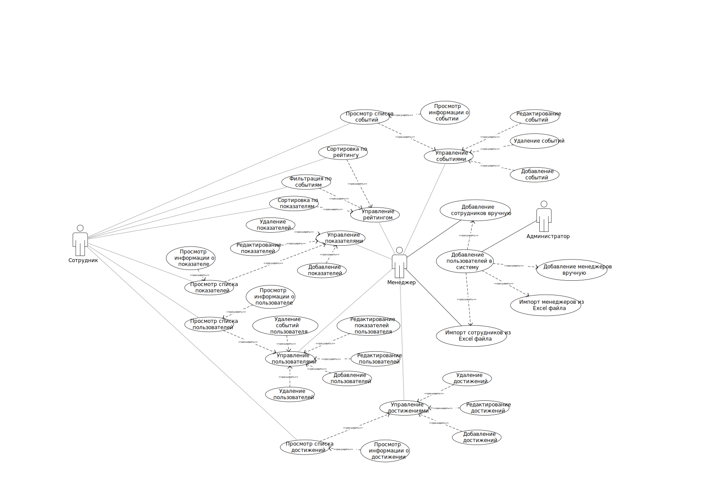

## 1. Перечень заинтересованных лиц

* **Заказчик системы:** для улучшения производительности сотрудников компании
* **Менеджеры:** для улучшения производительности сотрудников отделов и отчетность по достижениями сотрудников
* **Сотрудники:** повышение мотивации в работе и получение дополнительных бонусов

## 2. Перечень функциональных требований

* Возможность управления показателями
  * Добавить показатель, по которому может быть присвоено достижение
  * Редактировать показатель, по которому может быть присвоено достижение
  * Удалить показатель, по которому может быть присвоено достижение
  * Добавить период сброса для показателя
  * Добавить период сброса без активности для показателя

* Возможность использования правил
  * Добавить правило для показателя, при выполнении которого может быть присвоено достижение
  * Редактировать правило для показателя, при выполнении которого может быть присвоено достижение
  * Удалить правило для показателя, при выполнении которого может быть присвоено достижение
* Возможность использования достижений
  * Добавить достижение (описание, наименование, изображение)
  * Редактировать достижение (описание, наименование, изображение)
  * Удалить достижение (описание, наименование, изображение)
  * Добавить ограничение во времени для достижения
  * Редактировать ограничение во времени для достижения
  * Удалить ограничение во времени для достижения
* Возможность использования событий
  * Добавить событие, за участие в котором может быть присвоено достижение
  * Редактировать событие
  * Удалить событие
  * Добавить ограничение во времени для событий
  * Редактировать ограничение во времени для событий
  * Удалить ограничение во времени для событий
* Сбор статистики
  * Возможность собрать статистику пользователя
  * Просмотр места в рейтинге
  * Просмотр прогресса выполненных достижений
  * Фильтрация достижений по параметрам

## 3. Диаграмма вариантов использования для функциональных требований

В данной лабораторной будут реализованы только варианты использования от ролей Менеджера и Администратора.

 

## 5. Перечень нефункциональных требований

1. Требование к надежности – система должна уметь обрабатывать неожиданное поведение, например – выход из строя серверной части, или отсутствие подключения к сети у пользователя.
2. Требование к простоте развертывания – система должна иметь руководство по развертыванию, а также этот процесс должен быть стандартизированным и взят из популярных практик, например – использования контейнеризации в docker.
3. Требование к удобству использования – система должна обладать удобным и интуитивно понятным интерфейсом, который способен обеспечить пользовательский опыт без дополнительного прочтения документации, а также темной и светлой темой для адаптации пользователей с разной восприимчивостью цветов.
4. Требования к переносимости – система (интерфейс) должна работать во всех современных браузерах и операционных системах, включая мобильные устройства и обладать там полнофункциональным интерфейсом.
5. Требование к возможности локализации – система должна работать на русском и английском языках.
6. Требование к наблюдаемости – система должна иметь возможность сбора ошибок пользователей и агрегацию их в доступном для конфигурации под конкретную установку месте (например – sentry).
