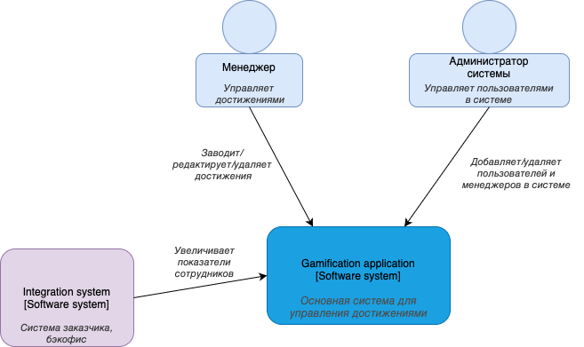
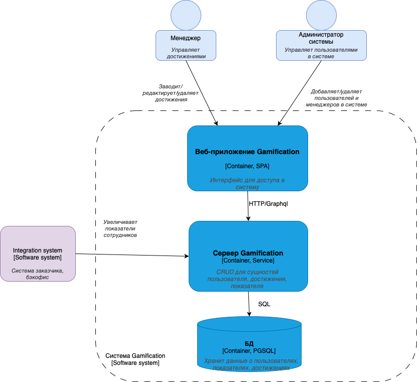
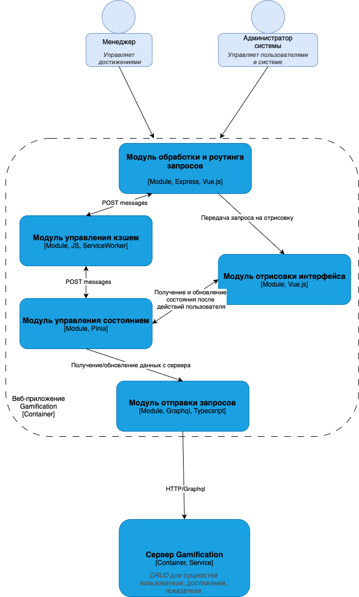

# Лабораторная работа 2

**Тема:** Cистема по учету и управлению достижениями

## 1. Диаграмма системного контекста

 

## 2. Диаграмма контейнеров

Исходя из нефункциональных требования к интерфейсу и надежности системы выбрано разделение на 2 сервиса (фронт и бэк) и отдельный контейнер с БД, что позволит разрабатывать и развертывать сервисы по отдельности, соответственно масштабировать также.

Связь для простоты разработки между контейнерами будет обеспечивать GraphQL, чтобы не было оверхеда в виде большого количества CRUD API ендпойнтов.

 

## 3. Диаграмма компонентов

Сделано для контейнера веб приложения

 
