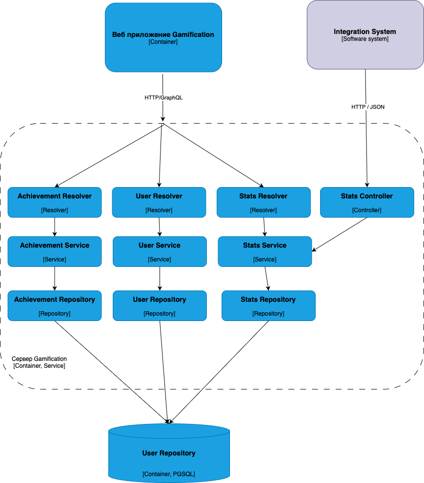
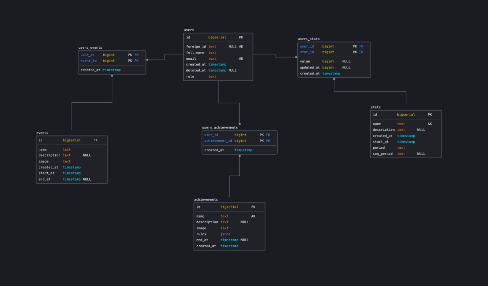

# Лаб 3

## Диаграмма компонентов

Веб-приложение:
 

Серверное приложение:
 

## Модель базы данных

 

  Краткое пояснение к модели базы данных:

- users: Содержит информацию о пользователях.
- events: ивенты (аналог достижений).
- stats: показатели (например - кол-во выполненных заданий).
- achievements: достижения (например - показатель выполненных заданий больше 20).
- users_events: таблица связи пользователей и ивентов в которых они поучаствовали.
- users_stats: связь пользователей и показателей в системе.
- users_achievements: таблица связи пользователя и его достижений.

## Код с учетом принципов KISS, YAGNI, DRY и SOLID

Код: [frontend](https://github.com/Gamification-team-HSE/gamification-frontend), [backend](https://github.com/Gamification-team-HSE/gamification-backend)

Пояснение:

- KISS (Keep It Simple, Stupid): В коде избежали сложных и больших функций, и каждый метод отвечает только за маленький кусочек функционала, например [LocalStorageService](https://github.com/Gamification-team-HSE/gamification-frontend/blob/main/src/services/LocalStorageService.ts) на фронтенде

- YAGNI (You Ain't Gonna Need It): Неиспользуемый код линтится и удаляется, лишние функции не пишутся, только под требуемый функционал

- DRY (Don't Repeat Yourself): Компоненты Vue.js переиспользуются многократно, также как и функции обработки данных, например компонент ненайденных данных на странице [SearchNotFoundComponent.vue](https://github.com/Gamification-team-HSE/gamification-frontend/blob/main/src/components/SearchNotFoundComponent.vue)

- SOLID:
  - `Single responsibility` - [LocalStorageService](https://github.com/Gamification-team-HSE/gamification-frontend/blob/main/src/boot/theme.ts) сервис отвечает только за работу с LocalStorage на фронтенде
  - `Open–closed` - Go реализует принцип открытости для расширения и закрытости для модификации на уровне типов, то есть язык устроен так, что по дефолту реализует данный принцип
  - `Liskov substitution` - в Go весь язык построен на имплементации интерфейсов и передачу как интерфейс. [Пример](https://github.com/Gamification-team-HSE/gamification-backend/blob/95c47419754eb793af49f936af62b5704fd1425e/internal/repositories/cache/auth/repository.go)
  - `Interface segregation` - В Go принцип разделения интерфейса решается тем, что в функции мы можем передавать интерфейсы, которые обобщают и ограничивают поведение структур, которые мы можем в эту функцию передать.
  Пример [создание сервиса, в качестве аругментов передаются интерфейсы репозиториев](https://github.com/Gamification-team-HSE/gamification-backend/blob/95c47419754eb793af49f936af62b5704fd1425e/internal/services/event/service.go#L230)
  - `Dependency inversion` - все компоненты Vue.js это реализуют по умолчанию - вы определяете типы props и можете прокинуть только этот тип, не зависимо от реализации. В Go, при соблюдении четырех предыдущих принципов этот принцип также выполняется автоматически.

## Дополнительные принципы разработки

### BDUF (Big Design Up Front)

 **Масштабное проектирование прежде всего**

В нашем проекте мы приняли решение отказаться, потому что требования менялись под заказчика в процессе разработки системы и принцип бы принес избыточность по времени, поэтому приняли решение двигаться итеративно.

### SoC (Separation of Concerns)

 **Принцип разделения ответственности**

В разработке на Vue.js + Go разделение ответственности по умолчанию рекомендовано при написании бизнес-логики продукта, в данном проекте также были разделены зоны ответственности между различными модулями, отвечающими за свои небольшие зоны (например - модуль авторизации во фронтенде отделен от модуля всех пользователей).

### MVP (Minimum Viable Product)

 **Минимально жизнеспособный продукт**

Проект развивался итеративно и в качестве одного из этапов был создан MVP с минимальным набором функций и несложным интерфейсом для авторизации и создания/изменения показателей и достижений, а в последствии продукт был дополнен функционалом событий, улучшенным интерфейсом и конструктором условий для событий и достижений.

### PoC (Proof of Concept)

 **Доказательство концепции**

Для ускорения разработки и упрощения взаимодействия контейнеров бэкенда и фронтенда в момент выбора технологий был предложен GraphQL и проведен эксперимент по запуску с ним системы авторизации - он оказался успешным и технология была использована в дальнейшем вместо REST API, который планировался по умолчанию в начале проекта.
